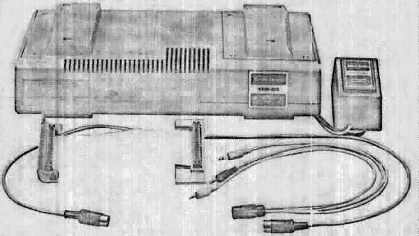

# Capabilities and Advantages

The Interface allows you to add the following Radio Shack modules to your system:

1. Screen Printer (26-1151)
2. Line Printer (26-1150)
3. Mini-Disk System (26-1160/26-1161)
4. Cassette Recorder number 2 (14-841)

The Screen Printer and Line Printer allow you to obtain hard copy (printed) information generated by your TRS-80.

The TRS-80 Mini-Disk System is a small version of the floppy disk. It provides vast storage space and much quicker access time than tape. The number 1 disk contains about 80,000 bytes of free space for files. Each additional disk has 89,600 bytes of file space. The Disk System has its own set of commands that allow manipulation of files and expanded abilities in file use. The TRS-80 Mini-Disk System uses sequential or random access. The disks will allow use of several additional LEVEL II commands.

Because of the presence of a Disk Controller in the Expansion Interface, the computer will try to input the additional commands.

When the Expansion Interface is connected to the computer, it assumes that a Mini-Disk is connected. To use the Expansion Interface without a Mini-Disk, press the BREAK key on the TRS-80 keyboard. This will override the Mini-Disk mode and allow normal LEVEL II operation.

The use of two cassettes allows a much more efficient and convenient manner of updating data stored on tape. For example, if you have payroll data stored on tape, the information can be read, one item at a time, from Cassette Recorder number 1, then changed or added to and written out on Cassette Recorder number 2. The example cited is a very simple application; however, very powerful routines can be constructed to allow input and output of data using two tapes simultaneously.

This unit is designed to be used with Level II only. Do not use with level I.

FIGURE 1. Expansion Interface.*

| * Catalog Number | Description | RAM |
|-----------------|-------------|-----|
| 26-1140 | TRS-80 Expansion Interface | 0K |
| 26-1141 | TRS-80 Expansion Interface | 16K |
| 26-1142 | TRS-80 Expansion Interface | 32K |

