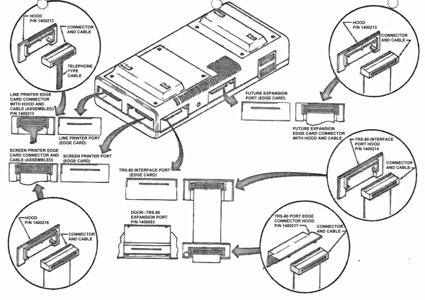

# Electrical Connections

Turn the TRS-80 so that it faces away from you. Locate the port Door (1400083); it's at the right end of the rear panel. To remove the Door, raise it up and slide it to the right—then lift it up and away from the TRS-80.

Place the TRS-80 and Expansion Interface Hoods (14000217 and 14000214) on the Ribbon Cable Connectors as shown in the following figure. The Hoods replace the Door on the TRS-80 and fill the opening on the Expansion Interface. These Hoods are designed so that it is not possible to insert the connectors upside down. They function as keyways for the connectors. Now connect the Ribbon Cable between the left front Expansion Interface port and the TRS-80 port.

Connect the DC Power Cord (DIN connector) to the POWER connector on the right rear of the TRS-80 and connect both AC Power Cords to standard 120 VAC outlets.

The interconnect cable for an expansion module is provided with that unit. See the following figure for Hood Assembly and Installation.

Connect the Cassette Recorder Cable (DIN plug on one end and three plugs on the other) to the Tape I/O connector that is located on the rear of the Expansion Interface nearest the Power Cord exits.

Of the three plugs on the other end of the Cable:

1. Connect the black plug to the EAR jack on the side of the Cassette Recorder.
2. Connect the larger gray plug to the AUX jack.
3. Connect the smaller gray plug to the REM jack.

A Dummy Plug is provided with your Cassette Recorder. Plug it in to the MIC jack. This Plug disconnects the built-in microphone so it won't pick up sounds while you are loading tapes.

FIGURE 4. Front View—Interface Connections.

Connect the Cassette Recorder Jumper Cable to the center DIN connector on the rear of the Expansion Interface. Connect the other end to the TAPE connector on the right rear of the TRS-80.

Connect the Video Cable from the Video Display to the VIDEO connector on the right rear of the TRS-80.

Your Cassette Recorders may be powered by batteries or from a 120 VAC source. Thus, AC power cords are optional.

The TRS-80 Expansion Interface has been designed to support the Video Display module. Set the feet of the Video Display in the recesses in the Power Supply and PCB Housing Doors. 