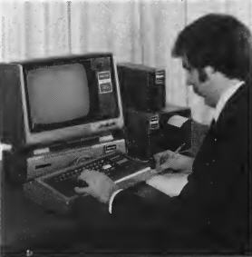

# Three Typical E-X-P-A-N-D-E-D [computer_model] Systems

## 4K "EDUCATOR" System
The "EDUCATOR" System includes our screen printer for a "hard copy" computing system useful in keeping track of household records and point-of-sale receipts. In addition, the "EDUCATOR" is ideally suited for computer-assisted instruction programs.

INCLUDES:
- [computer_model] with 4K RAM, Level-I BASIC (26-1001)
- 12" Video Display (26-1201)
- Realistic® CTR-41 Cassette Recorder (14-841)
- [computer_model] Screen Printer (26-1151)
- [computer_model] "PROFESSIONAL" SYSTEM

## 16K "PROFESSIONAL" System
"PROFESSIONAL" System offers 16K RAM, mini-disk system, and a screen printer for applications in science and engineering, clinical laboratories, statistical analysis, and software development. A major plus of this
is its potential to eliminate expensive "on-line" costs.

INCLUDES:
- [computer_model] with 16K RAM, Level-II BASIC (26-1006)
- 12" Video Display (26-1201)
- CT-41 Recorder (14-841)
- [computer_model] Screen Printer (26-1151)
- [computer_model] [peripheral_name] (26-1140)
- [computer_model] Mini-Disk System (26-1160)

## 32K "BUSINESS" SYSTEM
A line printer and two mini-disk units are featured in the "BUSINESS" System. Possible applications include general ledger and payroll, accounts receivable/accounts payable, inventory control, mailing lists, sales and market analysis, and use in medical and dental offices.

INCLUDES:
- [computer_model] with 16K RAM, Level-II BASIC (26-1006)
- 12" Video Display (26-1201)
- CTR-41 Recorder (14-841)
- [computer_model] Line Printer (26-1150)
- [computer_model] [peripheral_name] (26-1140)
- Two [computer_model] Mini-Disk Systems (26-1160)
- 16K RAM Memory Option (26-1101)

For more information, please see our instructive video about the TRS-80's capabilities: <video src="https://www.youtube.com/watch?v=0xW_4NXU3jI?autoplay=0" controls poster="images/video_ad_still.png" />
